<a id="mulu">目录</a>
<a href="#mulu" class="back">回到目录</a>
<style>
    .back{width:40px;height:40px;display:inline-block;line-height:20px;font-size:20px;background-color:lightyellow;position: fixed;bottom:50px;right:50px;z-index:999;border:2px solid pink;opacity:0.3;transition:all 0.3s;color:green;}
    .back:hover{color:red;opacity:1}
    img{vertical-align:bottom;}
</style>

<!-- @import "[TOC]" {cmd="toc" depthFrom=3 depthTo=6 orderedList=false} -->

<!-- code_chunk_output -->

- [概述](#概述)
- [基础知识](#基础知识)
    - [变量](#变量)
      - [系统预定义变量](#系统预定义变量)
      - [自定义变量](#自定义变量)
      - [特殊变量](#特殊变量)
    - [运算符](#运算符)
    - [条件判断](#条件判断)
      - [中括号](#中括号)
      - [双小括号](#双小括号)
    - [补充：let和双小括号](#补充let和双小括号)
- [流程控制](#流程控制)
    - [if](#if)
    - [case](#case)
    - [for](#for)
    - [while](#while)
    - [读取控制台输入](#读取控制台输入)

<!-- /code_chunk_output -->

<!-- 打开侧边预览：f1->Markdown Preview Enhanced: open...
只有打开侧边预览时保存才自动更新目录 -->

写在前面：此笔记来自b站课程[3天搞定Linux，1天搞定Shell](https://www.bilibili.com/video/BV1WY4y1H7d3) P66-P
### 概述
shell是外层应用程序与系统内核连接的桥梁，本质上一个命令行解释器——它接收应用程序/用户的命令，然后调用操作系统内核
**基本格式**：
- 注释以`#`开头
- 脚本第一行指定解析器`#!/bin/bash`
- 之后的就是shell代码

**执行方式**：
- bash/sh+脚本的绝对/相对路径
    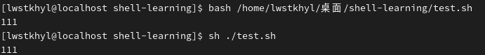{:width=80 height=80}
- 直接输入脚本的绝对/相对路径，但要为脚本添加可执行权限`chmod +x 脚本路径`
    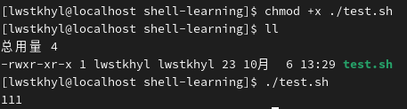{:width=120 height=120}
    可以看到文件名变成绿色，代表可被执行
    注：使用相对路径时不能直接写`test.sh`，必须写成`./test.sh`。因为系统会将`test.sh`当成命令（在/bin目录中寻找同名文件）去执行

为什么第一种方式不需可执行权限：第一种实际上是运行`sh`或`bash`命令，脚本路径作为参数；而第二种是将脚本名作为命令
**补充：使用`.`或`source`命令也可执行脚本文件**
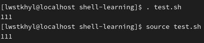{:width=80 height=80}
区别：前两种都是再开一个**子shell**进程去执行脚本，而`.`和`source`是直接在当前shell环境中执行。有时候子shell会出现内外层环境变量不通用的问题，这时就需要`.`和`source`来执行，例如有时更改了某个配置文件，为使其立即生效，就运行`source .profile`命令

---

**补充：能不能通过直接输入脚本名称的方式来运行脚本？**
其实是可以的，因为系统会在`/bin`中找命令/脚本文件，所以如果该文件位于`/bin`目录下，就可以这样执行。但一般情况下，不推荐改变`/bin`目录中的文件
方法：更改`$PATH`变量，相当于Windows环境变量中的path
### 基础知识
##### 变量
主要分为系统定义的和用户定义的变量，还可分为全局变量和局部变量
- 全局变量是当前bash进程和其子进程都可访问
- 局部变量只在当前bash进程中可访问，其子进程无法访问

使用`set`/`set | less`命令查看当前环境内的全部变量
###### 系统预定义变量
可以理解成环境变量，通常是全局的
- `HOME`主目录路径
- `PWD`当前工作目录
- `SHELL`当前使用的shell解释器
- `USER`当前用户
- 还有很多类似的，都是由大写字母组成的

```sh
echo $HOME  # 查看某个系统变量
printenv HOME  # 查看某个系统变量，不需要加$符号
env  # 查看全部系统变量
env | less  # 更清楚地查看
printenv
printenv | less  # 同上，也是查看全部系统变量
```
`printenv`只是单纯查看变量值，所以不加`$`，正常情况下我们想使用变量，都要在变量名加`$`，例如
```sh
ls $HOME  # 查看主目录内容
```
###### 自定义变量
- **定义/更改变量**：`变量名=变量值`，注意`=`**前后不能有空格**，因为加了空格之后bash会将空格前的内容当成命令
- **删除变量**：`unset 变量名`
- **声明只读变量**：`readonly 变量名=变量值`，它不能被修改/删除

**变量定义规则**：
- 变量名可由字母、数字、下划线组成，不能以数字开头
- 环境变量名建议大写
- 变量默认类型都是字符串类型，不能直接进行数值运算
- 变量值如果有空格，需用单/双引号括起来；如果没空格，可以不加引号直接写（反之默认都是字符串）

**补充**：
- 使用`echo $变量名`输出变量值
- 如果一个变量名没有声明/赋值，也可以用上述方法输出，只是结果为空行，不会报错

**注意**：
- 使用`变量名=变量值`创建的都是局部变量，如果希望其提升为全局变量，可以使用`export 变量名`，这样它就可以在子shell中使用。但如果在子shell中对该变量重新赋值，只有子shell中的这个变量发生改变，外层的该变量不变（即使在子shell中使用export也不行）
- 如果我们在命令行中声明了局部变量，现在运行一个shell脚本，其中用到了上述局部变量
  - 使用`.`/`source`运行，可以访问到，因为它们都是在当前进程中运行的
  - 使用`sh`/`bash`/路径运行，不能访问，因为它们是在子shell中运行，子shell不能访问父级的局部变量
    
  解决方法：使用export提升父级变量

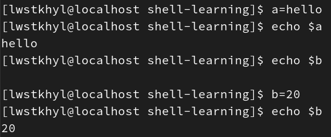{:width=150 height=150}
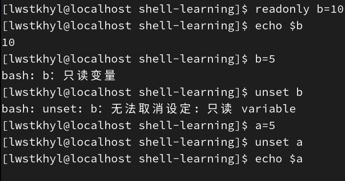{:width=200 height=200}
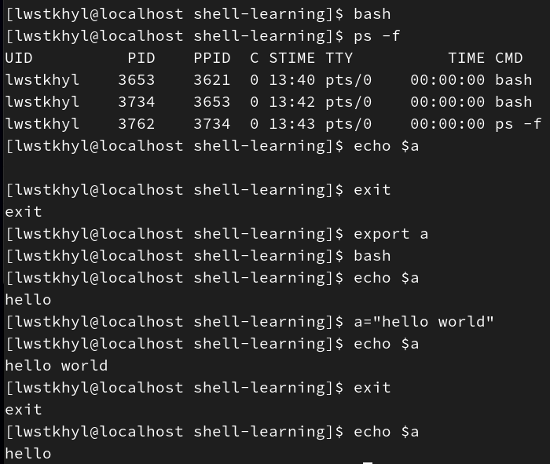{:width=400 height=400}
其中`bash`命令可以打开一个子shell，`ps -f`检查是否在子shell中（如果由两个bash就是在子shell）
创建`test.sh`：
```sh
#!/bin/bash
echo $my_var
```
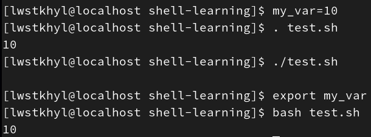{:width=150 height=150}
###### 特殊变量
注：所有的特殊变量只有在**双引号**中或者**不加引号**才会被认为是变量，在单引号中会被认为是普通字符串
- `$n`：n为数字，表示在命令行中执行该脚本时后面跟着的参数——`$0`代表该脚本名称（命令行中执行的文件名称），`$1`-`$9`代表第1-9个参数，如果n>=10，需用大括号包含，如`${10}`
- `$#`获取所有输入的参数个数（不包括脚本名称`$0`），常配合循环使用，配合参数的个数是否正确
    ```sh
    #!/bin/bash
    echo '-------------$n----------------'
    echo "I'm $0"
    echo "Hello, $1"
    echo '-------------$#----------------'
    echo parameter numbers: $#
    ```
    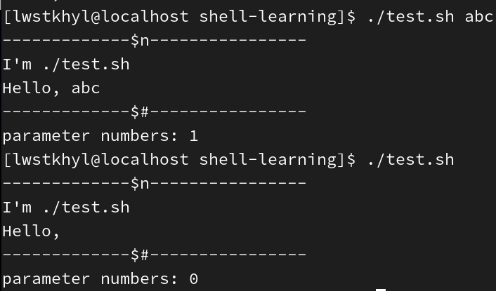{:width=250 height=250}
- `$*`获取所有参数（把所有的参数都看成一个整体）
- `$@`获取所有参数构成的集合（把每个参数区分对待）
    注：如果不使用循环遍历，上面得到的结果其实是一样的
    ```sh
    #!/bin/bash
    echo '-------------$*----------------'
    echo $*
    echo '-------------$@----------------'
    echo $@
    ```
    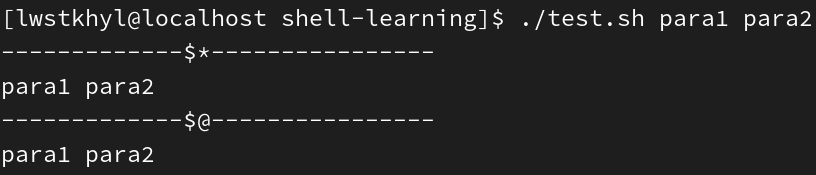{:width=100 height=100}
- `$?`获取上一次执行的命令的返回状态。如果其值为0，则上个命令正确执行；如果非0，则说明执行出错（具体是哪个值由上个命令自己决定）
    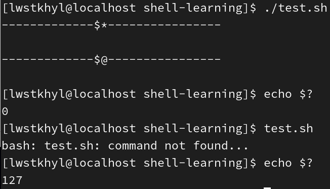{:width=220 height=220}

---

补充：什么时候变量名前要加`$`？
**给变量赋值/修改值的时候不加，使用变量（读取值）的时候加**
##### 运算符
**第一种实现运算的方式**：`expr 表达式`，表达式的每个数字和运算符间必须有空格，支持+-*/，但如果使用`*`，必须写成`\*`进行转义
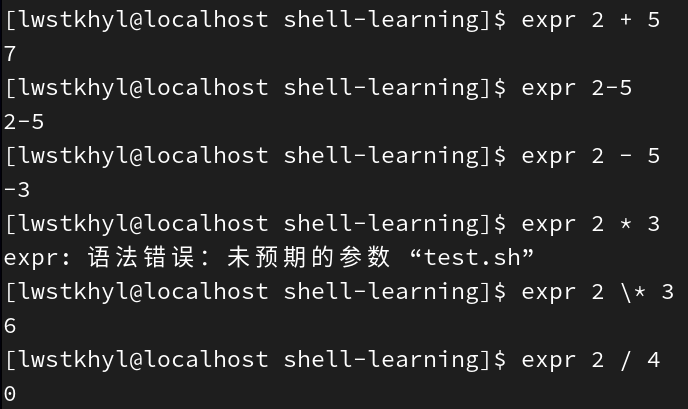{:width=250 height=250}
这种方式过于麻烦，因此通常不使用
**第二种实现运算的方式**：`$((表达式))`或`$[表达式]`，表达式中不必写空格。它本质上一个变量，因此可以用一个变量来接收，并用echo的方式输出其值
补充：使用`expr 表达式`的方法也可以给变量赋值，`a=$(expr 表达式)`或```a=`expr 表达式` ```，当然一般情况下也不用这种方式
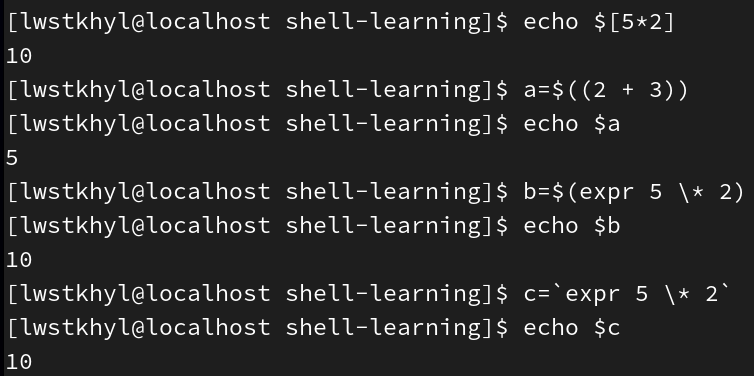{:width=220 height=220}
**例**：创建`add.sh`，接收两个参数，输出这两个参数的和
```sh
#!/bin/bash
sum=$[$1+$2]
echo sum=$sum
```
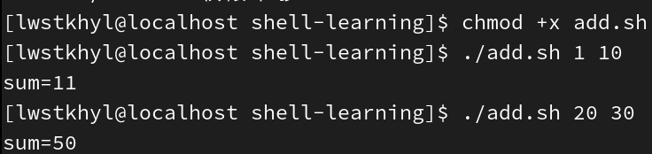{:width=100 height=100}
##### 条件判断
**第一种方法（不常用）**：`test 条件表达式`，若条件为true则返回0，反之返回1，在执行完该命令后，通过`echo $?`获取它的返回值
###### 中括号
**第二种方法**：`[ 条件表达式 ]`，注意**条件表达式前后要有空格**，返回值同上
注意：
- 条件表达式中值和判断符号间也要有空格
- 如果条件表达式中只有一个值则返回true，条件表达式为空（如`[  ]`）返回false

```sh
a=hello
test a = hello
echo $?  # 1
test $a = hello
echo $?  # 0
[ $a != hello ]
echo $?  # 1
[ $a ]
echo $?  # 0
[  ]
echo $?  # 1
```
**常用判断条件**：
- 字符串（两个字符串分别放在判断符两侧）
  - 等于`=`
  - 不等于`!=`
- 两个整数间比较（两个数分别放在判断符两侧）
  - 等于`-eq`
  - 不等于`-ne`
  - 小于`-lt`
  - 小于等于`-le`
  - 大于`-gt`
  - 大于等于`-ge`
- 文件权限（文件名放判断符后面）
  - `-r`是否有读的权限
  - `-w`是否有写的权限
  - `-x`是否有执行的权限
- 文件类型（文件名放判断符后面）
  - `-e`文件/目录是否存在
  - `-f`文件是否存在
  - `-d`目录是否存在

```sh
[ 2 -gt 8 ]
echo $?  # 1
[ -x add.sh ]
echo $?  # 0
[ -e test2.sh ]
echo $?  # 1
```
**多条件判断**：
- 第一种方法——使用`&&`和`||`进行多条件判断：`[ $a = $b ] && [ $a = $c ]`
  - `&&`表示当前一条命令执行成功时，才执行后**一条**命令
  - `||`表示当前一条命令执行失败时，才执行后**一条**命令

  利用这个原理，可以写出**shell中的三元表达式**：`[ 条件表达式 ] && 语句1 || 语句2`
  ```sh
  [ 2 -lt 5 ] && [ 3 -lt 5 ]
  echo $?  # 0
  [ 2 -lt 5 ] || [ 3 -gt 5 ] && [ 4 -gt 5 ]
  echo $?  # 1
  a=15
  [ $a -lt 20 ] && echo "$a < 20" || echo "$a >= 20"  # 15 < 20
  [  ]  && echo "true" || echo "false"  # false
  ```
- 第二种方法——使用`-a`/`-o`参数分别表示与/或：`[ $a = $b -a $a = $c ]`
###### 双小括号
**第三种方法**：`((条件表达式))`，不用写空格，可以直接使用数学符号比较大小，常用于流程控制语句中
```sh
((2>3))
echo $?  # 1
a=3
(($a>=3))
echo $?  # 0
(($a<3))
echo $?  # 1
((a<3))  # 等效于(($a<3))，可省略$
echo $?  # 1
```
##### 补充：let和双小括号
可以看到，上面提到的方法中，如果想使用运算符号，必须在外面写上`$[]`或`$(())`，里面的变量也要加`$`
因此shell提供了简化：
`let 运算式`和`((运算式))`，它们允许运算式中直接使用变量，并支持各种运算符号（如`+=`、`++`等）
```sh
a=0
let a++
echo $a  # 1
a=0
let a++
((a+=1))
echo $a  # 2
let a*=5
echo $a  # 10
```
### 流程控制
##### if
**单分支**：
```sh
if [ 条件判断式 ];then
  程序
fi
# 或者
if [ 条件判断式 ]
then
  程序
fi
```
注：
- `;`用于分隔同一行的多个命令，所以也可以写成`if [ 条件判断式 ]; then 程序; fi`的形式
- `[ 条件判断式 ]`也可写成双小括号形式，下同

**多分支**：
```sh
if [ 条件判断式 ]
then
  程序
elif [ 条件判断式 ]
  程序
else
  程序
fi
```
其中elif段可省略，直接else
**例：单分支**
```sh
# 单分支
age=20
if [ $age -gt 18 ]; then echo "age>18"; fi

if [ $age -gt 18 ]; then
 echo "age>18"
fi

if [ $age -gt 18 ]
then
 echo "age>18"
fi

# 多条件判断
a=30
if [ $a -gt 18 ] && [ $a -lt 30 ]; then
 echo ok
fi

if [ $a -gt 18 -a $a -lt 30 -o $1 -gt 20 ]; then
 echo ok
fi
```
**例：多分支**
```sh
if [ $1 -ge 80 ]
then
 echo A
elif [ $1 -ge 60 ]; then
 echo B
else
 echo C
fi

if [ $2 -ge 60 ]
then
 echo pass
else
 echo "not pass"
fi
```

---

补充：如果我们需要对传入的参数进行判断，比如`[ $1 = abc ]`这种，一般要确保`$1`非空
方法：写成`[ "$1"x = "abc"x ]`的形式
原理：相当于进行字符串拼接。在`$1`后加上别的字符，确保`=`左侧非空
```sh
# 当不传参数时会报错
if [ $1 = abc ]; then
 echo ok
fi
# 不会报错
if [ "$1"x = "abc"x ]; then
 echo ok
fi
```
##### case
```sh
case 变量 in
值1)
  程序1
;;
值2)
  程序2
;;
*)
  如果变量都不是以上的值，则执行此段程序
;;
esac
```
- `;;`相当于break
- `*(`相当于default
- `case`行尾必须为`in`，每个子case的值必须以`)`结束

例：
```sh
case $1 in
"abc")
 echo '$1=abc'
;;
1)
 echo '$1=1'
;;
2)
 echo '$1=2'
;;
*)
 echo "没有匹配的值"
;;
esac
```
```sh
./test.sh 60  # 没有匹配的值
./test.sh 1  # $1=1
./test.sh 2  # $1=2
./test.sh abc  # $1=abc
```
##### for
有两种不同的语法，分别对应`for(i=1;i<10;i++)`和`for i in list`
- 第一种
  ```sh
  for((初始值;循环控制条件;变量改变))
  do
    程序
  done
  ```
  注：循环控制条件中可以用`<=`这种判断大小，变量改变中也有`i++`和`i--`，这是因为它们被双小括号`(())`包裹
- 第二种
  ```sh
  for 变量 in 值1 值2 值3 ...
  do
    程序
  done
  # 或
  for 变量 in {1..100}  # 表示1,2,3,...,100的序列
  do
    程序
  done
  ```

**例**：求1-`$1`的累加结果
```sh
sum=0
for((i=1;i<=$1;i++))
do
 sum=$(($sum+$i))
done
echo $sum
```
注意`sum=$(($sum+$i))`中要用`$(())`进行包裹，以及使用变量时要加`$`

---

补充：`$*`和`$@`的区别
如果它们都不加引号，直接写在for循环中，则都是一个包含所有参数的序列，没有区别
如果加上双引号，则`"$*"`会把所有参数拼接成一个字符串整体，而`"$@"`仍是一个序列
```sh
echo '--------$*---------'
i=0
for para in $*
do
 i=$[$i+1]
 echo $i$para
done
echo '--------$@---------'
i=0
for para in $@
do
 i=$[$i+1]
 echo $i$para
done
echo '--------"$*"---------'
i=0
for para in "$*"
do
 i=$[$i+1]
 echo $i$para
done
echo '--------"$@"---------'
i=0
for para in "$@"
do
 i=$[$i+1]
 echo $i$para
done
```
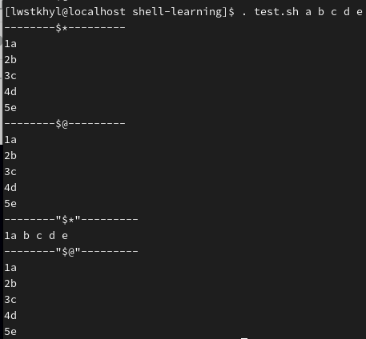{:width=400 height=400}
##### while
```sh
while [ 条件判断式 ]
do
  程序
done
```
**例**：求1-`$1`的累加结果
```sh
sum=0
i=1
while [ $i -le $1 ]
do
 sum=$[$sum+$i]
 ((i++))  # 也可以写成i=$[$i+1]
done
echo $sum
```
##### 读取控制台输入
`read -t 等待时间 -p 提示符 变量名`
- `-p 提示符`：等待输入时的提示文字
- `-t 等待时间 `：等待时间（单位为秒），超过等待时间后会退出等待输入状态，不加该参数表示一直等待
- `变量名`：即指定是哪个变量接收输入值

```sh
read -t 5 -p "name:" name
echo "hello, $name"
```
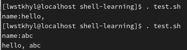{:width=100 height=100}
