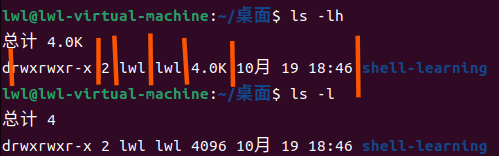

<a id="mulu">目录</a>
<a href="#mulu" class="back">回到目录</a>
<style>
    .back{width:40px;height:40px;display:inline-block;line-height:20px;font-size:20px;background-color:lightyellow;position: fixed;bottom:50px;right:50px;z-index:999;border:2px solid pink;opacity:0.3;transition:all 0.3s;color:green;}
    .back:hover{color:red;opacity:1}
    img{vertical-align:bottom;}
</style>

<!-- @import "[TOC]" {cmd="toc" depthFrom=3 depthTo=6 orderedList=false} -->

<!-- code_chunk_output -->

- [基础知识](#基础知识)
- [常用命令](#常用命令)
    - [查询一个命令的使用方法和存放位置](#查询一个命令的使用方法和存放位置)
    - [显示文件和目录](#显示文件和目录)
    - [切换工作目录](#切换工作目录)
    - [创建目录](#创建目录)
    - [创建和打开文件](#创建和打开文件)
    - [删除文件和文件夹](#删除文件和文件夹)
    - [拷贝](#拷贝)
    - [移动文件和文件夹](#移动文件和文件夹)
    - [显示日历/日期](#显示日历日期)
    - [查看历史指令](#查看历史指令)
    - [查看或合并文件内容](#查看或合并文件内容)
    - [分页查看文件内容](#分页查看文件内容)
    - [关机重启](#关机重启)
- [进阶操作](#进阶操作)
    - [数据流和管道命令](#数据流和管道命令)

<!-- /code_chunk_output -->

<!-- 打开侧边预览：f1->Markdown Preview Enhanced: open...
只有打开侧边预览时保存才自动更新目录 -->

写在前面：此笔记是对之前[txt版笔记](https://github.com/lwstkhyl/Ubuntu)的整理总结
### 基础知识
**主要的文件夹**：
- **根目录**：`/`，所有文件都在它里面
- **用户工作目录/家目录/主目录**：`/home/user`，其中`user`为用户名，每一个用户都会对应一个user文件夹；这个目录也是打开文件图标默认显示的目录
- **`/bin`和`/usr/bin`**：可执行二进制文件，包含Linux中常用的一些命令
- **`/etc`**：当前系统内的配置文件，不建议在此目录下存放其它文件
- **`/root`**：拥有最大权限的目录，一般用户不能对其进行操作

**打开终端的方式**：
- 右键->`在终端中打开`
- 点击屏幕左侧的终端图标
- `CTRL`+`alt`+`t`

**终端命令格式**：`command [-options] [parameter]`
- `command`：命令
- `-options`：选项（可选，可以是多个），通常以`-`开头
  注：如果有多个选项`-r -f -l`，可以简写成`-rfl`，通常选项的顺序不影响结果
- `parameter`：参数（可选，可以是多个），通常没有`-`

**终端中的快捷键**：
- `CTRL`+`l`：清屏，即清除终端上的已经执行过的命令行。也可使用命令`clear`
- `tab`：自动补全，包括命令和文件名称。如想删除一个名为`2.txt`的文件夹，当当前目录下只有它是以2开头时，就可以输入`rm 2`后按tab键，就能自动补全。如果有多个项目都以输入的文字开头，按tab就会列出所有以该文字开头的项目
- 上下键`↑` `↓`：查看之前写过的指令
- `CTRL`+`shift`+`c`复制  `CTRL`+`shift`+`v`粘贴
- `CTRL`+`c`：在终端中停止正在执行的进程
- `CTRL`+`shift`+`=`调大终端窗口大小  `CTRL`+`shift`+`-`调小
  注：有些系统中使用`CTRL`+`-`调小
### 常用命令
##### 查询一个命令的使用方法和存放位置
使用方法：
- `man 命令名称`
  打开查询界面后，按`回车`会往下翻一行，`空格`翻一屏，`f`显示下一屏，`b`显示上一屏，`q`退出查询界面，想要在查询界面搜索某内容就输入`/想查的内容`，例如输入`/-l`，会将查询界面中所有`-l`显示高亮（注意`/`是主键盘右下的，不是小键盘上面的）
- `命令名称 --help`
  有的命令使用这种方式查询时会显示中文

```sh
# 查询ls命令
man ls
ls --help
```
存放位置：`which 命令名称`
##### 显示文件和目录
- `pwd`：查看当前所在目录
- `tree`：以树状图列出当前目录的内容（包含的文件），若想查看当前路径下某文件夹的内容，就在后面直接加上文件夹名
  例如在主目录文件夹中打开终端，输入`tree snap`，就是查看主目录中snap文件夹包含的文件
- `ls`：以列表方式列出当前目录的内容
  显示的文件名有不同颜色：蓝色--目录，白色--文件，绿色--可执行文件，红色--压缩包
  - `ls -a`：显示所有文件（包含隐藏文件，以`.`开头）
  - `ls -l`：以更详细的方式显示文件
  - `ls -h`：用K/M显示文件大小，一般与`-l`联用，即`ls -l -h`/`ls -lh`
    从左往右的列分别为：类型的描述|文件权限|硬链接数|文件所属的用户|文件所属的组|文件大小|修改时间|文件夹名称
    {:width=150 height=150}
    - 类型的描述：开头的第一个字母，分为`-`文件、`d`目录、`l`链接文件
    - 文件权限：第2-9个字母
    - 硬链接数：该文件有几个快捷方式
    - 文件大小默认以字节为单位
##### 切换工作目录
`cd 绝对/相对路径`
- `cd .`：打开下级目录（只能在当前文件夹中只有一个文件夹时使用）
- `cd ..`/`cd ../`：打开上级目录
- `cd`/`cd ~`：直接回到主目录
- `cd /`：打开根目录
- `cd -`：表示返回上一次打开的目录
##### 创建目录
- `mkdir 文件夹路径`
- `mkdir -p 文件夹路径`递归创建

例如：
- `mkdir test`：在当前目录下创建一个test文件夹
- `mkdir ./test/a`：就是在当前目录的test文件夹内创建a文件夹
- `mkdir -p a/b/c`：在当前目录下创建一个a，再在a里面创建一个b，最后在b里面创建一个c
##### 创建和打开文件
- 创建文件：`touch 文件路径`
  例如：
  `touch 1.txt`：在当前目录下创建一个名为1的txt文件
  `touch 2.txt 3.txt 4.txt`：一次性创建多个文件
- 打开文件：`gedit 文件路径`，使用方法同上
  文件关闭前不能继续在该终端下写其它内容，注意该指令不在所有Linux系统中通用（如sendos就没有）
##### 删除文件和文件夹
`rm 文件路径`：删除之后不能恢复（用终端指令删除不会经过回收站），例如`rm 1.txt`
- `rm -i`：在删除前有个提示，让你再次确认是否删除，输入y继续删除，输入n不删除
  注：这个提示在sendos系统中是默认有的，但在Ubuntu中没有
- `rm -f`：强制删除，在任何系统中都不再提示是否删除
- `rm -r`：递归删除一个文件夹及其中的所有内容
##### 拷贝
`cp 源文件路径 目标文件路径`
```sh
cp 2.txt test2  # 把2.txt拷贝到test2文件夹内
cp 2.txt test2/2.txt  # 把2.txt内容覆盖拷贝到test2里的2.txt内
```
注：如果test2中已有2.txt，则会覆盖；如果没有2.txt就创建一个并拷贝内容
- `cp -i`：如果需要进行覆盖会提示一下，也是y覆盖、n不覆盖
- `cp -f`：强制覆盖不提示
- `cp -v`：显示拷贝过程，如`cp -v 2.txt test2`时会多显示一行`'2.txt'->'test2/2.txt'`
- `cp -r`：递归拷贝（想拷贝的是一个文件夹时使用），如`cp -r test2 test1`就是把test2里面的文件拷贝到test1文件夹内
- `cp -a`：通常在拷贝文件夹时使用，保留权限、属性等
##### 移动文件和文件夹
`mv 源文件路径 目标文件路径`
```sh
mv a/2.txt .  # 把a文件夹中的2.txt移动到终端目录下内
mv 3.txt 2.txt  # 把3.txt重命名为2.txt
```
注意：mv移动时也是默认覆盖同名文件
- `mv -i`：如果需要进行覆盖会提示一下，也是y覆盖、n不覆盖（若选择不覆盖则不会执行移动操作）
- `mv -v`：显示移动过程
- `mv -f`：强制覆盖不提示

注：`mv`没有`-r`操作，可以直接移动文件夹，如`mv test1 a/test1`/`mv test1 a`就是把test1文件夹移动到a文件夹中，注意是移动整个文件夹而不是只移动其中的内容，结果是a中会有一个test1文件夹与原test1文件夹相同
##### 显示日历/日期
- cal系列：显示日历
  - `cal -3`：显示上个月这个月下个月的日历
  - `cal -y`：显示这年的日历
  - `cal -j`：以“今年的第多少天”形式显示日历
  - `cal 年份`：显示该年的日历，例如`cal 2000`就是显示2000年的
- date系列：显示日期、星期、时间
  - `date "+%Y"`：显示是哪年
  其中`%Y`还可以替换成`%m`月、`%d`日、`%H`时、`%M`分、`%S`秒、`%F`年-月-日、`%T`时-分-秒，中间还可以加其它字符
  ```sh
  date "+%Y年" #  2023年
  date "+%Y年%m月" #  2023年9月
  date "+%Y%m" #  202309
  date "+%F" #  2023-09-02
  date "+%F %T" #  2023-09-02 12:30:47
  ```
##### 查看历史指令
- `history n`：（n为整数）显示最近n条历史指令
- `!n`：（n为整数）执行编号为n的历史指令

```sh
history #  最近30条历史指令
!805  # 执行编号为805的历史指令
```
##### 查看或合并文件内容
`cat 文件路径`：直接把文件内容输出到命令行中，而使用`gedit`命令打开文件时会阻塞
- `cat -n`：在文件内容前显示行数（编号），包括空行
- `cat -b`：在非空行前显示行数，注意这里不会给空行进行编号，12345只从非空行开始写
- `cat -s`：把两行及以上的空行合并成1行显示

注：可以添加多个文件路径，同时打开，例如`cat 1.txt 2.txt`就是把`1.txt`和`2.txt`中的内容一起显示出来，若添加编号选项也会连续编号
##### 分页查看文件内容
`more 文件路径`：每次只显示一页（当文件内容很多时，会出现快速滚屏，无法看清文件内容）
**相关按键**：
- 显示下一页：`空格键`/`CTRL`+`f`/`f`可以
- 往下翻一行：回车键
- 后退一页：`CTRL`+`b`/`b`
- 退出显示：`q`

**命令参数**：
- `more +5`：从第5行开始显示文件内容
- `more -p`：先清屏再显示文件内容
- `more -s`：把两行及以上的空行合并成1行显示

注：`more 1.txt 2.txt`也可以一起显示两个文件，但与`cat`不同，`more`会在显示的内容前标注文件名
##### 关机重启
- `reboot`或`shutdown -r`：重启
- `shutdown 15:10`：在15:10关机
- `shutdown +20`：20分钟后关机
- `shutdown -h now`：立刻关机
- `shutdown -c`：取消关机

**注**：
- 尽可能少用关机指令
- 执行这些关机或取消关机的命令时，会给其它用户发送提示
### 进阶操作
##### 数据流和管道命令
**输入流**：从键盘或文件中读取内容到内存中
**输出流**：从计算机内存中把数据写入到文件/显示器上
**重定向**：改变数据流原来的默认走向，有两种方式
- `命令 > 文件`：将命令输出内容**覆盖**写到文件中
- `命令 >> 文件`：将命令输出内容**追加**写到文件中

例如`echo "abc"`会在命令行中输出"abc"，而`echo "abc" > 2.txt`会把"abc"写到`2.txt`内（覆盖原内容），并且命令行中不会显示"abc"；`echo "abc" >> 2.txt`不会覆盖，会在文件原最后一行的下一行接着写"abc"
其它有输出的命令也可以使用`>`和`>>`，例如`ls -l > ls.txt`就是把`ls -l`在终端中输出的内容写到ls.txt中

---

**管道命令**：`指令1|指令2|指令3...`，将`指令1`的输出信息，输入给`指令2`，再把`指令2`的输出给`指令3`，以此类推
例如，`ls -l /`可以显示根目录文件信息、`more`后面加上文件内容可以让其分屏显示，则`ls -l / |more`就可以把根目录信息分屏显示
